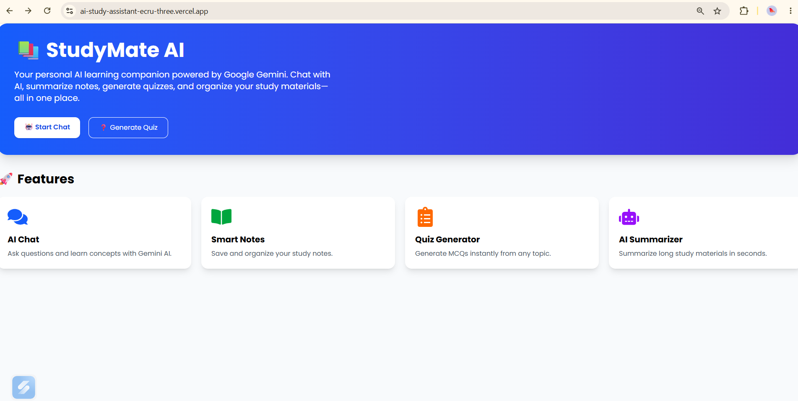
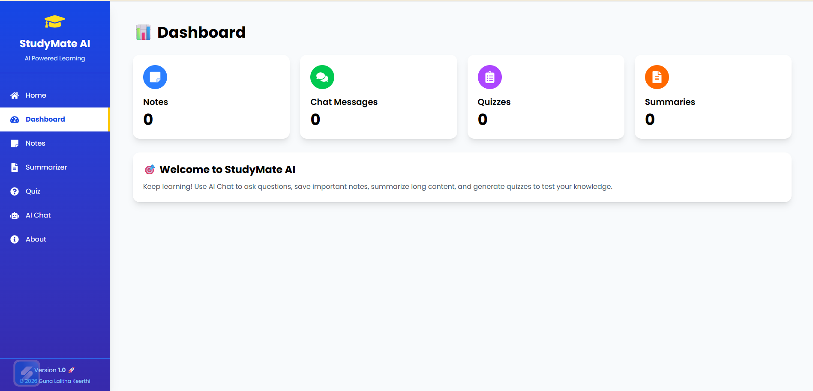
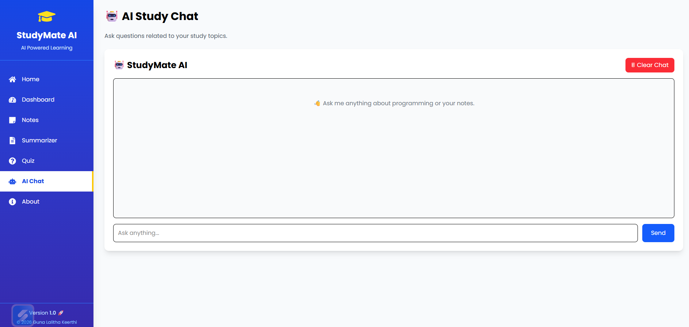
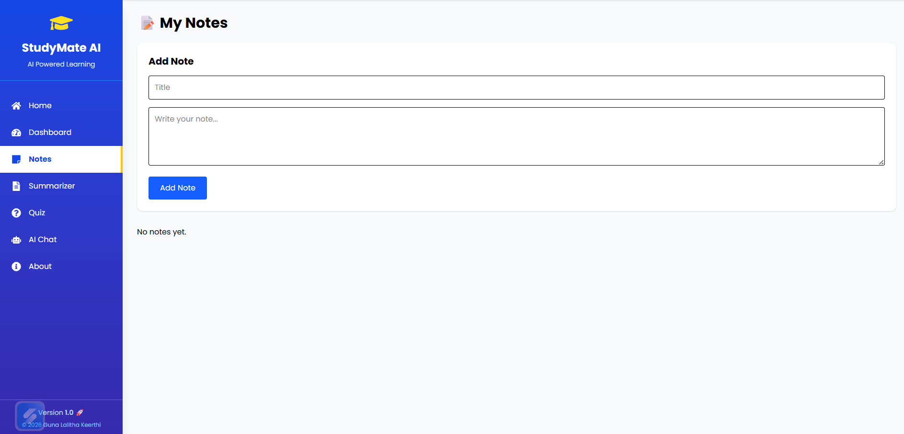
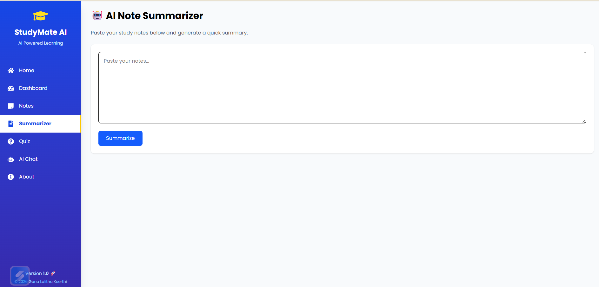
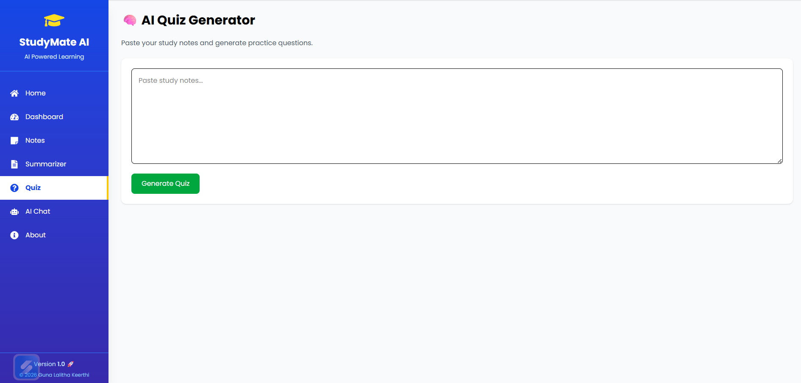

# 📚 StudyMate AI


StudyMate AI is an AI-powered study assistant built using React, Vite, Tailwind CSS, and Google Gemini API. It helps students learn more effectively by providing AI chat, note management, quiz generation, and text summarization in one application.

## 🎯 Project Objective

StudyMate AI is designed to help students learn more effectively by using AI to answer questions, summarize study material, generate quizzes, and organize notes in one place.

---

## 🚀 Features

- 🤖 AI Chat powered by Google Gemini
- 📝 Create, edit, and manage study notes
- 📄 AI Text Summarizer
- ❓ AI Quiz Generator
- 📊 Dashboard with study overview
- 📱 Responsive and modern user interface
- 🔐 Fast and secure deployment using Vercel

---

## 🛠️ Technologies Used

- React.js
- Vite
- Tailwind CSS
- React Router DOM
- Google Gemini API
- JavaScript (ES6+)
- HTML5
- CSS3
- Vercel

---

## 📂 Project Structure

```
src/
├── assets/
├── components/
├── layouts/
├── pages/
├── routes/
├── services/
├── App.jsx
└── main.jsx
```

---

## ⚙️ Installation

Clone the repository:

```bash
git clone https://github.com/Keerthi3113/ai-study-assistant.git
```

Go to the project folder:

```bash
cd ai-study-assistant
```

Install dependencies:

```bash
npm install
```

Create a `.env` file and add:

```env
VITE_GEMINI_API_KEY=YOUR_API_KEY
```

Run the application:

```bash
npm run dev
```

Build for production:

```bash
npm run build
```

---

## 📸 Screenshots

### 🏠 Home Page


### 📊 Dashboard


### 🤖 AI Chat


### 📝 Notes


### 📄 Summarizer


### ❓ Quiz Generator


---

## 🌐 Live Demo

🔗 **Live Website:** https://ai-study-assistant-ecru-three.vercel.app

---

## 👩‍💻 Author

**Guna Lalitha Keerthi**

GitHub: https://github.com/Keerthi3113

---

## 📄 License

This project is developed for educational and portfolio purposes.